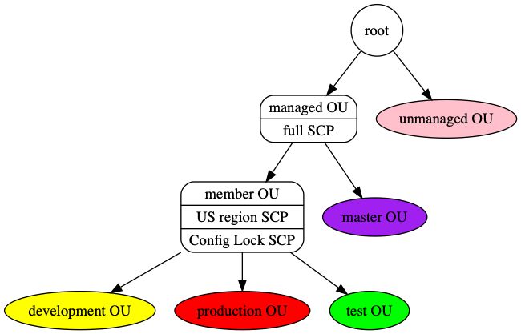

# Organization
Our organization is the AWS EDP (enterprise discount plan) organization

##  

### root
all accounts in EDP org

### unmanaged
un managed account in EDP org, no scps

### managed
all ucop managed accounts in EDP org

### master
EDP org master account

### member
non master ucop managed accounts

### test
test OU for testing org features ucop managed accounts like scp, tag policies, new rules, etc

### development
non production ucop managed accounts

### production
production ucop managed accounts

#### Providers

| Name | Version |
|------|---------|
|  [aws](#provider_aws) | n/a |

#### Modules

No modules.

#### Inputs

| Name | Description | Type |
|------|-------------|------|
|  [name](#input_name) | Resource name | `string` |
|  [test_accounts](#input_test_accounts) | map of managed accounts | <pre>map(object({     email          = string,     billing_access = string,     name           = string,     ou             = string,     tags = object({       ucopapplication        = string,       ucopavailability_level = string,       ucopprotection_level   = string,       ucopenvironment        = string,       ucopbusiness_contact   = string,       ucopservice            = string,       ucopservice_owner      = string,       ucoptechnical_contact  = string,     })     })   )</pre> |
|  [enabled_ous](#input_enabled_ous) | to create Organization OUs | `bool` |
|  [tags](#input_tags) | A map of tags to add to all resources | `map(string)` |
